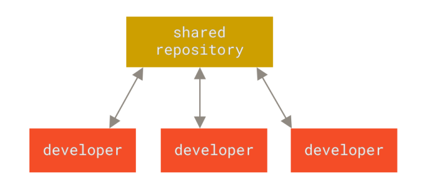
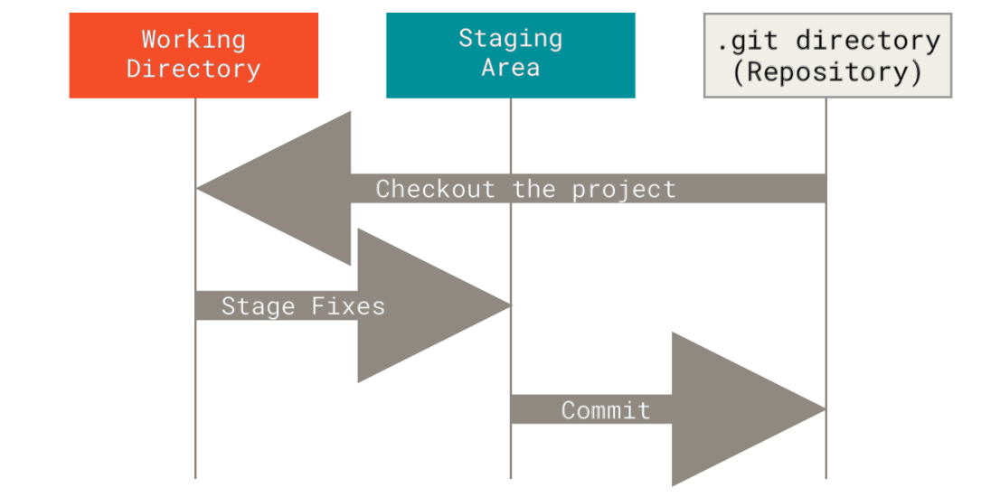
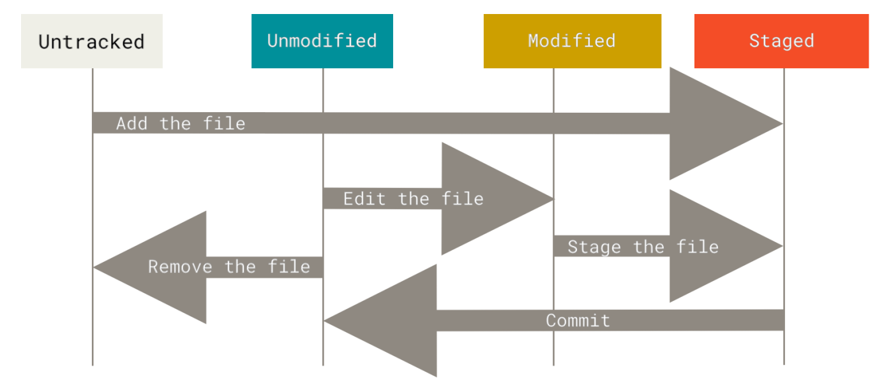

# ST211: Open Source Software

<p align="justify">
The practical objective of this course you will learn how to participate in OSS projects
by improving aspects of the software that they feel that they're wrong, suggesting
possible improvement, or just raising issues for the existing solutions.
As a side object of this course you will learn C# which an open source language created by
Microsoft in 2000 and originally started as closed source project and then converted to
an open source project in 2015 as a part of Microsoft's software revolution.
</p>

## Section 1: Version Control, Git, and GitHub

### Command Prompt (aka CMD)

The Command Prompt is the default command-line interpreter for all the Windows NT family and more.
It's the counterpart of [COMMAND.COM](https://en.wikipedia.org/wiki/Disk_operating_system)
in [DOS](https://en.wikipedia.org/wiki/DOS) and Unix shells on Unix-like systems.

- Syntax: -

```bash
# Command B will only execute if Command A completes successfully,
# and the execution of Command C depends on the successful completion of Command B
PATH> CommandA [&& CommandB && CommandC]

# On the contrary using & will execute commands regardless
PATH> CommandA [& CommandB & CommandC]

# Example
C:\>echo Hello World
```

- [Commands Cheat Sheet](cmd.pdf)
- [Commands Cheat Sheet with Git](cmd-git.png)

### Types of Software

- Proprietary Software

  Only the owners of such software projects have full legal access to the source code involved,
  although they may grant inspection rights to trusted partners who have signed non-disclosure agreements (NDAs).
  For this reason, this model is also called closed source.

  To use proprietary software, end users must accept a license restricting their rights,
  often through a confusing click-through box presented after a very long and dense description during install.


- Free Software

  Free software, infrequently known as freedom-respecting software, is computer software distributed
  under terms that allow users to run the software for any purpose as well as to study, change, and distribute it and
  any adapted versions.


- Open Source Software

  An open-source license is a type of license for computer software and other
  products that allows the source code, blueprint or design to be used, modified
  and/or shared under defined terms and conditions. This allows end users and
  commercial companies to review and modify the source code, blueprint or design
  for their own customization, curiosity or troubleshooting needs. Open-source
  licensed software is mostly available free of charge, though this does not
  necessarily have to be the case.

### Version Control

Version control is a system that records changes to a file or set of files over time so that you can recall specific
versions later.

- Local Version Control Systems

  Many people’s version-control method of choice is to copy files into another directory (perhaps a
  time-stamped directory, if they’re clever). This approach is very common because it is so simple, but
  it is also incredibly error prone. It is easy to forget which directory you’re in and accidentally write
  to the wrong file or copy over files you don’t mean to.

  In the early 1980s, a system called RCS was release, which is still distributed with many
  computers today. RCS works by keeping _patch sets_ (that is, the differences between files) in a special
  format on disk; it can then re-create what any file looked like at any point in time by adding up all
  the patches.


- Centralized Version Control Systems

  The next major issue that people encounter is that they need to collaborate with developers on
  other systems. To deal with this problem, Centralized Version Control Systems (CVCSs) were
  developed. These systems (such as CVS, Subversion, and Perforce) have a single server that contains
  all the versioned files, and a number of clients that check out files from that central place. For
  many years, this has been the standard for version control.
  <br />
  <br />
  However, this setup also has some serious downsides. The most obvious is the _single point of failure_
  that the centralized server represents. If that server goes down for an hour, then during that hour
  nobody can collaborate at all or save versioned changes to anything they’re working on. If the hard
  disk the central database is on becomes corrupted, and proper backups haven’t been kept, you lose
  absolutely everything, the entire history of the project except whatever single snapshots people
  happen to have on their local machines. Local VCS systems suffer from this same
  problem, whenever you have the entire history of the project in a single place, you risk losing
  everything.



- Distributed Version Control Systems

  This is where Distributed Version Control Systems (DVCSs) step in. In a DVCS (such as Git, Mercurial,
  Bazaar or Darcs), clients don’t just check out the latest snapshot of the files; rather, they fully
  mirror the repository, including its full history. Thus, if any server dies, and these systems were
  collaborating via that server, any of the client repositories can be copied back up to the server to
  restore it. Every clone is really a full backup of all the data.
  <br />
  <br />
  **Why should we use a centralized server then ?**

### History of Git

As with many great things in life, Git began with a bit of creative destruction and fiery controversy.
The Linux kernel is an open source software project of fairly large scope. For most of the lifetime of
the Linux kernel maintenance (1991–2002), changes to the software were passed around as patches
and archived files. In 2002, the Linux kernel project began using a proprietary DVCS called
BitKeeper.

In 2005, the relationship between the community that developed the Linux kernel and the
commercial company that developed BitKeeper broke down, and the tool’s free-of-charge status
was revoked. This prompted the Linux development community (and in particular Linus Torvalds,
the creator of Linux) to develop their own tool based on some of the lessons they learned while
using BitKeeper.

Some of the goals of the new system were as follows:

- Speed
- Simple design
- Strong support for non-linear development (thousands of parallel branches)
- Fully distributed
- Able to handle large projects like the Linux kernel efficiently (speed and data size)

### Getting Started with Git

Git Terminologies: -

The _working tree_ is a single checkout of one version of the project. These files are pulled out of the
compressed database in the Git directory and placed on disk for you to use or modify.

The _Git directory_ is directory where Git stores the metadata and object database for your project. This is the
most important part of Git, and it is what is copied when you clone a repository from another
computer.

The _staging area_ is a file, generally contained in your Git directory, that stores information about
what will go into your next commit. Its technical name in Git parlance is the “index”, but the phrase
“staging area” works just as well.

_Commits_ are the core building block units of a Git project timeline.



The main stages for files in a Git repository



Here's some commands that you can use after installing Git to get started: -

```bash
# Show Git version (checking it's installed successfully)
git --version

# Configure Git globally to all repository
git config --global user.name "ibrahim-gamal"
git config --global user.email "ibrahim@tanta.uni"
git config --list

# Check Config values
git config <key>
```

### Git Basics

```bash
# Initialize Git
git init

# Add to Staging Area
git add <filename>
# Or,
git add *.<fileextension>
# Or,
git add --a

# Remove file from Staging Area
git reset <filename>

# Delete the file from project and stage the removal for commit 
git rm <filename>

# Check Files Status
git status
git status -s # short status

# Commit files from Staging Area
git commit -m "Initial Commit"

# diff of what is changed but not staged
git diff

# diff of what is staged but not yet committed
git diff --staged

# Check repo history
git log
git log -3
git log --stat

# Connect to remote repo
git remote add origin https://github.com/FCI/Open-Source-Software.git

# Push Commits
git push origin master

# Clone Repo
git clone <url>

# Pull History
git pull

# Undoing Things
git commit --amend
```

Ignoring files

```bash
cat .gitignore

# ignore all .a files
*.a

# but do track lib.a, even though you're ignoring .a files above
!lib.a

# only ignore the TODO file in the current directory, not subdir/TODO
/TODO

# ignore all files in any directory named build
build/

# ignore doc/notes.txt, but not doc/server/arch.txt
doc/*.txt

# ignore all .pdf files in the doc/ directory and any of its subdirectories
doc/**/*.pdf
```

[Git Cheat Sheet](git-cheat-sheet-education.pdf)

### GitHub

GitHub is the single largest host for Git repositories, and is the central point of collaboration for
millions of developers and projects. A large percentage of all Git repositories are hosted on GitHub,
and many open-source projects use it for Git hosting, issue tracking, code review, and other things.

What you should know is the following: -

1) Create an account
2) Create a repository
3) README.md
4) .gitignore
5) Licenses
6) Connect to local Repo
7) Perform git operations (Pull, Push, History, View Changes, New Branch, Merge Branches, PRs)
8) Issues
9) GitHub Repository Actions (Issues, Watch, Fork, Stars)

### Task: Work on Your Own

```text
You're asked to implement a website that: -
1- Takes the name of the user in a prompt
2- Returns it in a reversed order in an alert.

This task will be submitted in a Google Form, but this time you will be asked to hand over the public
GitHub repository that you created that contains the code for this task.

Please, make sure to do the following: -
1) Create the repository from your own repository
2) Make the repository contains at least 2 commits
```